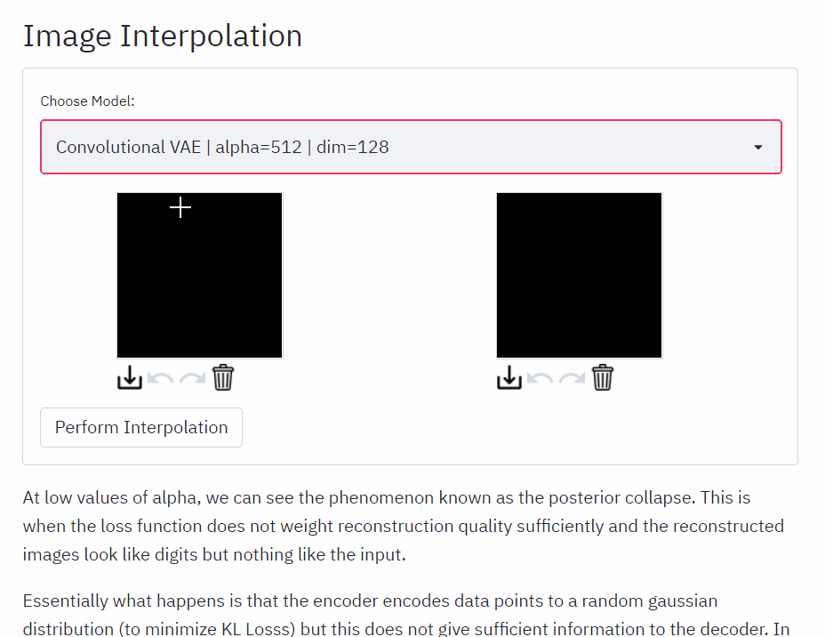

# VAE Playground

This project started out as a simple test to implement Variational Autoencoders using PyTorch Lightning but evolved into a 4 part blog/tutorial on TowardsDataScience. 
Check them out here:

[Part 1: Mathematical Foundations and Implementation](https://towardsdatascience.com/beginner-guide-to-variational-autoencoders-vae-with-pytorch-lightning-13dbc559ba4b) \
[Part 2: Supercharge with PyTorch Lightning](https://towardsdatascience.com/beginner-guide-to-variational-autoencoders-vae-with-pytorch-lightning-part-2-6b79ad697c79) \
[Part 3: Convolutional VAE, Inheritance and Unit Testing](https://towardsdatascience.com/beginner-guide-to-variational-autoencoders-vae-with-pytorch-lightning-part-3-9d686d0d85d9) \
[Part 4: Deployment](https://towardsdatascience.com/building-a-vae-playground-with-streamlit-aa88a3394c04)



## Demo :computer:

Hosted on Heroku

https://vae-playground.herokuapp.com/


## Model Training

You can train the VAE models by using `train.py` and editing the `config.yaml` file. \
Hyperparameters to change are:
- model_type
- alpha
- hidden_dim
- dataset


## Running with Docker :whale:

### Pull Image from Docker Hub
```bash
docker pull reoneo/vae-playground
docker run -p 8501:8501 -e PORT=8501 reoneo/vae-playground
```

### Building Image from Dockerfile
```bash
docker build . -t <tag>
docker run -p 8501:8501 -e PORT=8501 <tag>
```

This will host the app on `localhost:8501`
