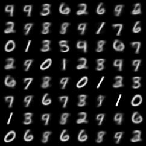

# mnist-vae

Pytorch Lightning implementation of Variational Autoencoders on MNIST Dataset 
Medium Article: https://towardsdatascience.com/beginner-guide-to-variational-autoencoders-vae-with-pytorch-lightning-13dbc559ba4b

