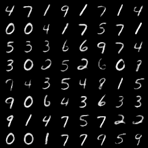

# VAE Playground

This project started out as a simple test to implement Variational Autoencoders using PyTorch Lightning but evolved into a 4 part blog/tutorial on TowardsDataScience. 


Pytorch Lightning implementation of Variational Autoencoders on MNIST Dataset 
Medium Article: https://towardsdatascience.com/beginner-guide-to-variational-autoencoders-vae-with-pytorch-lightning-13dbc559ba4b



## Demo

Hosted on Heroku

https://vae-playground.herokuapp.com/

## Installation


## Model Training


### Docker

The Docker container contains model checkpoints that are too large to upload onto github. You can run this using:

```bash
```